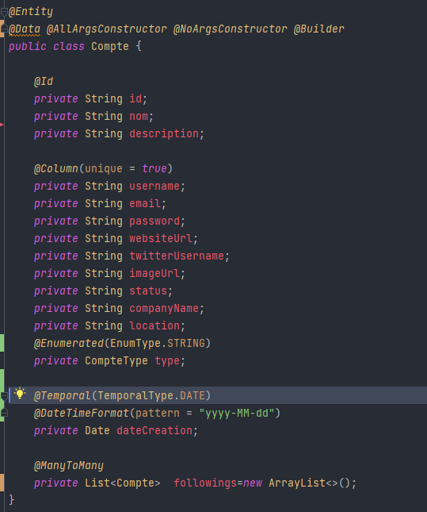
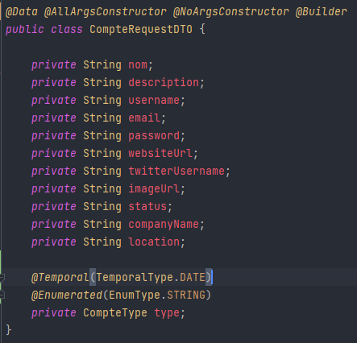
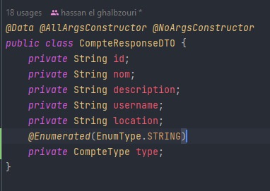
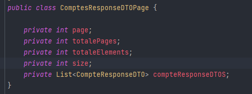
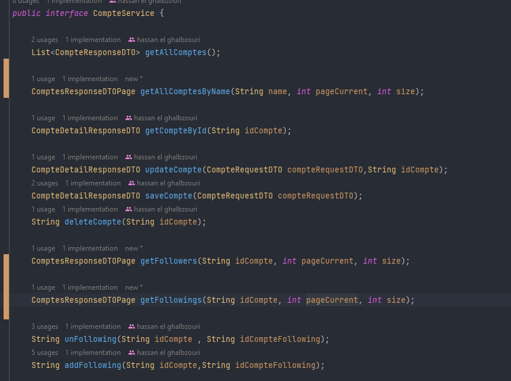
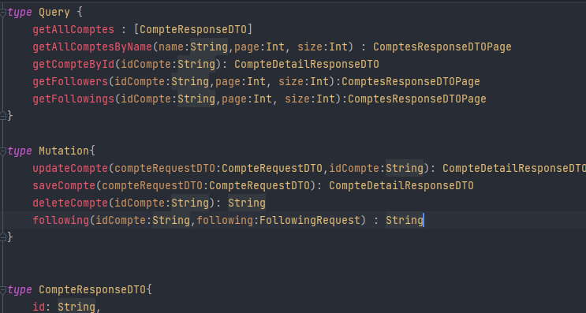

# Micro Service Compte 

### Dependencies :

[pom.xml :point_right:](./pom.xml)

 - spring web 
 - spring data jpa
 - lombok
 - h2 database 
 - mapstruct
 - spring security
 - javafaker
 - graphql


### Entities :

 - Compte : [:point_right:](./src/main/java/org/example/mscompte/entities/Compte.java)
    
    <div  align="center">
        
    </div>

### Enums :
 
 - CompteType : [:point_right:](./src/main/java/org/example/mscompte/enums/CompteType.java)

    <div  align="center">
            
    </div>


### DTO :

- `CompteRequestDTO` [:point_right:](./src/main/java/org/example/mscompte/dto/CompteRequestDTO.java) :

   <div  align="center">
        
    </div>

- `CompteResponseDTO` [:point_right:](./src/main/java/org/example/mscompte/dto/CompteResponseDTO.java) : les informations nécessaires des comptes 

   <div  align="center">
        
    </div>

- `CompteDetailResponseDTO` [:point_right:](./src/main/java/org/example/mscompte/dto/CompteDetailResponseDTO.java) : les informations en détail d'un compte

   <div  align="center">
            
    </div>


- `ComptesResponseDTOPage` [:point_right:](./src/main/java/org/example/mscompte/dto/ComptesResponseDTOPage.java) : list dans comptes mais avec pagénation

   <div  align="center">
            
  </div>


- `FollowingRequest` [:point_right:](./src/main/java/org/example/mscompte/dto/FollowingRequest.java) : request pour following ou unfollowing

   <div  align="center">
            
    </div>

### Repositories :

Par l'utilisation de JPA 

 - CompteRepository : [:point_right:](./src/main/java/org/example/mscompte/repositories/CompteRepository.java)

   <div  align="center">
        
   </div>


### Mappers :

Par l'utilisation de mapstruct 

 - CompteMapper : [:point_right:](./src/main/java/org/example/mscompte/mappers/CompteMapper.java)

   <div  align="center">
        
    </div>

...

### Exceptions :

 > CompteNotFoundException : [:point_right:](./src/main/java/org/example/mscompte/exceptions/CompteNotFoundException.java)

 > FollowingException : [:point_right:](./src/main/java/org/example/mscompte/exceptions/FollowingException.java)

 > UnfollowingException : [:point_right:](./src/main/java/org/example/mscompte/exceptions/UnfollowingException.java)
  

### Services :

 - CompteService : [:point_right:](./src/main/java/org/example/mscompte/services/CompteService.java)

    <div  align="center">
        
    </div>

    [CompteServiceImpl :point_right:](./src/main/java/org/example/mscompte/services/CompteService.java)


### MsCompteApplication : 

   [MsCompteApplication :point_right:](./src/main/java/org/example/mscompte/MsCompteApplication.java)

 - ajouter le passwordEncoder fonction:

    <div  align="center">
            
    </div>
   
 - ajouter les données par CompteService et utiliser faker pour fake données


### Application.properties :

 <div  align="center">
            
 </div>
   
 - pour disable security j'ai ajouter :
    ```
    spring.autoconfigure.exclude[0]=org.springframework.boot.autoconfigure.security.servlet.SecurityAutoConfiguration
    ```


### Web:

<details>
    <summary>
    RestAPI 
    </summary>

- CompteRestController : [:point_right:](./src/main/java/org/example/mscompte/web/CompteRestController.java)


```java
@GetMapping("/comptes")
public List<CompteResponseDTO> getAllComptesRest()
```

```java
@GetMapping("/comptes/search")
public ComptesResponseDTOPage getAllComptesByNameRest(@RequestParam(name = "nom",defaultValue = "") String name,
                                                          @RequestParam(name = "page",defaultValue = "0") int page,
                                                          @RequestParam(name = "size",defaultValue = "5") int size
                                                           )
```


```java
@GetMapping("/comptes/{idCompte}")
public CompteDetailResponseDTO getCompteByIdRest(@PathVariable(name = "idCompte") String idCompte)
```

```java
@PutMapping("/comptes/{idCompte}")
public CompteDetailResponseDTO updateCompteRest(@RequestBody CompteRequestDTO compteRequestDTO,
                                                @PathVariable(name = "idCompte") String idCompte)
```


```java
@PostMapping("/comptes")
public CompteDetailResponseDTO saveCompteRest(@RequestBody CompteRequestDTO compteRequestDTO)
```


```java
@DeleteMapping("/comptes/{idCompte}")
public String deleteCompteRest(@PathVariable(name = "idCompte") String idCompte)
```
    

```java
@GetMapping("/comptes/{idCompte}/followers")
public ComptesResponseDTOPage getFollowersRest(@PathVariable(name = "idCompte") String idCompte,
                                                    @RequestParam(name = "page",defaultValue = "0") int page,
                                                    @RequestParam(name = "size",defaultValue = "5") int size)
```

```java
@GetMapping("/comptes/{idCompte}/followings")
public ComptesResponseDTOPage getFollowingsRest(@PathVariable(name = "idCompte") String idCompte,
                                                     @RequestParam(name = "page",defaultValue = "0") int page,
                                                     @RequestParam(name = "size",defaultValue = "5") int size)
```

```java
@PutMapping("/comptes/{idCompte}/followings")
public String followingRest(@PathVariable(name = "idCompte") String idCompte , @RequestBody FollowingRequest following)
```


```java
@ExceptionHandler(Exception.class)
public ResponseEntity<String> exceptionsHandler(Exception e)
```
    


- test : [:point_right:](./REARME_TEST_RESTAPI.md)


</details>


<details>
    
 <summary>
    GRAPHQL
 </summary>


- CompteGraphqlController : [:point_right:](./src/main/java/org/example/mscompte/web/CompteGraphqlController.java)

```java
@QueryMapping()
public List<CompteResponseDTO> getAllComptes()
```

```java
@QueryMapping()
public ComptesResponseDTOPage getAllComptesByName(@Argument(name = "name") String name,
                                                    @Argument(name = "page") int page,
                                                    @Argument(name = "size") int size
        )
```


```java
@QueryMapping
public CompteDetailResponseDTO getCompteById(@Argument(name = "idCompte") String idCompte)
```


```java
@MutationMapping
public CompteDetailResponseDTO updateCompte(@Argument CompteRequestDTO compteRequestDTO, 
                                            @Argument(name = "idCompte") String idCompte)
```


```java
@MutationMapping
public CompteDetailResponseDTO saveCompte(@Argument CompteRequestDTO compteRequestDTO)
```

```java
@MutationMapping
public String deleteCompte(@Argument(name = "idCompte") String idCompte)
```


```java
@QueryMapping
public ComptesResponseDTOPage getFollowers(@Argument(name = "idCompte") String idCompte,
                                            @Argument(name = "page") int page,
                                            @Argument(name = "size") int size)
```


```java
@QueryMapping
public ComptesResponseDTOPage getFollowings(@Argument(name = "idCompte") String idCompte,
                                            @Argument(name = "page") int page,
                                            @Argument(name = "size") int size)
```


```java
@MutationMapping
public String following(@Argument(name = "idCompte") String idCompte , 
                        @Argument FollowingRequest following)
```


- CompteDataFetcherExceptionResolver : [:point_right:](./src/main/java/org/example/mscompte/exceptions/CompteDataFetcherExceptionResolver.java) : fetcher les exceptions pour l'affichier pour graphQl
- schema.graphqls : [:point_right:](./src/main/resources/graphql/schema.graphqls)

    <div  align="center">
            
    </div>

- test : [:point_right:](./REARME_TEST_GRAPHQL.md)

</details>