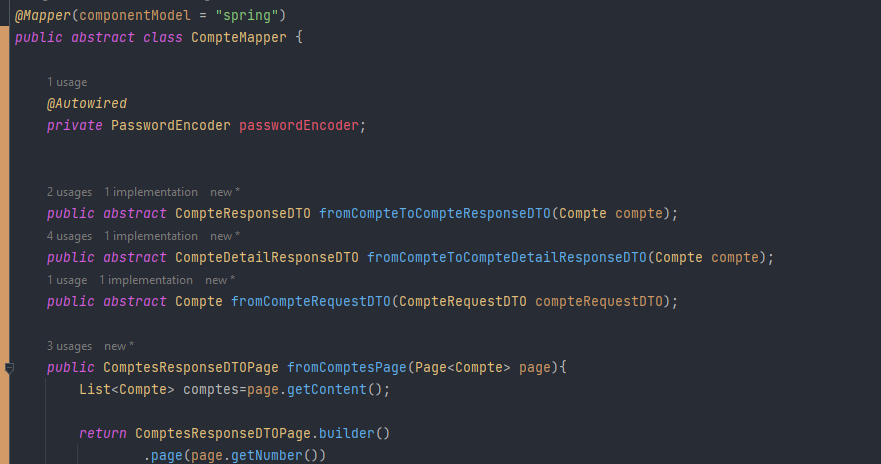

# Micro Service Compte 

### Dependencies :

[pom.xml :point_right:](./pom.xml)

 - spring web 
 - spring data jpa
 - lombok
 - h2 database 
 - mapstruct
 - spring security
 - javafaker


### Entities :

 - Compte : [:point_right:](./src/main/java/org/example/mscompte/entities/Compte.java)
    
    <div  align="center">
        
    </div>

### Enums :
 
 - CompteType : [:point_right:](./src/main/java/org/example/mscompte/enums/CompteType.java)

    <div  align="center">
            
    </div>


### DTO :

- `CompteRequestDTO` [:point_right:](./src/main/java/org/example/mscompte/dto/CompteRequestDTO.java) :

   <div  align="center">
        
    </div>

- `CompteResponseDTO` [:point_right:](./src/main/java/org/example/mscompte/dto/CompteResponseDTO.java) : les informations nécessaires des comptes 

   <div  align="center">
        
    </div>

- `CompteDetailResponseDTO` [:point_right:](./src/main/java/org/example/mscompte/dto/CompteDetailResponseDTO.java) : les informations en détail d'un compte

   <div  align="center">
            
    </div>


### Repositories :

Par l'utilisation de JPA 

 - CompteRepository : [:point_right:](./src/main/java/org/example/mscompte/repositories/CompteRepository.java)

   <div  align="center">
        
    </div>


### Mappers :

Par l'utilisation de mapstruct 

 - CompteMapper : [:point_right:](./src/main/java/org/example/mscompte/mappers/CompteMapper.java)

   <div  align="center">
            
    </div>
   

### Exceptions :

 > CompteNotFoundException : [:point_right:](./src/main/java/org/example/mscompte/exceptions/CompteNotFoundException.java)

 > FollowingException : [:point_right:](./src/main/java/org/example/mscompte/exceptions/FollowingException.java)

 > UnfollowingException : [:point_right:](./src/main/java/org/example/mscompte/exceptions/UnfollowingException.java)
  

### Services :

 - CompteService : [:point_right:](./src/main/java/org/example/mscompte/services/CompteService.java)

    <div  align="center">
            
    </div>

    [CompteServiceImpl :point_right:](./src/main/java/org/example/mscompte/services/CompteService.java)


### MsCompteApplication : 

   [MsCompteApplication :point_right:](./src/main/java/org/example/mscompte/MsCompteApplication.java)

 - ajouter le passwordEncoder fonction:

    <div  align="center">
            
    </div>
   
 - ajouter les données par CompteService et utiliser faker pour fake données


### Application.properties :

 <div  align="center">
            
 </div>
   
 - pour disable security j'ai ajouter :
    ```
    spring.autoconfigure.exclude[0]=org.springframework.boot.autoconfigure.security.servlet.SecurityAutoConfiguration
    ```


