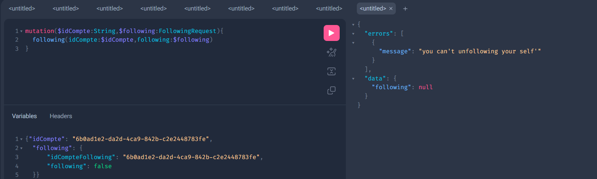

## Test GraphQl :


```java
@QueryMapping()
public List<CompteResponseDTO> getAllComptes()
```

<div  align="center">
            
 </div>


```java
@QueryMapping()
public ComptesResponseDTOPage getAllComptesByName(@Argument(name = "name") String name,
                                                    @Argument(name = "page") int page,
                                                    @Argument(name = "size") int size
        )
```

<div  align="center">
            
 </div>


```java
@QueryMapping
public CompteDetailResponseDTO getCompteById(@Argument(name = "idCompte") String idCompte)
```

<div  align="center">
            
 </div>


```java
@MutationMapping
public CompteDetailResponseDTO updateCompte(@Argument CompteRequestDTO compteRequestDTO, 
                                            @Argument(name = "idCompte") String idCompte)
```

<div  align="center">
            
 </div>


```java
@MutationMapping
public CompteDetailResponseDTO saveCompte(@Argument CompteRequestDTO compteRequestDTO)
```

<div  align="center">
            
 </div>

```java
@MutationMapping
public String deleteCompte(@Argument(name = "idCompte") String idCompte)
```
<div  align="center">
        
 </div>


```java
@QueryMapping
public ComptesResponseDTOPage getFollowers(@Argument(name = "idCompte") String idCompte,
                                            @Argument(name = "page") int page,
                                            @Argument(name = "size") int size)
```

<div  align="center">
        
 </div>

```java
@QueryMapping
public ComptesResponseDTOPage getFollowings(@Argument(name = "idCompte") String idCompte,
                                            @Argument(name = "page") int page,
                                            @Argument(name = "size") int size)
```
<div  align="center">
        
 </div>


```java
@MutationMapping
public String following(@Argument(name = "idCompte") String idCompte , 
                        @Argument FollowingRequest following)
```

<div  align="center">
            
 </div>

<div  align="center">
        
 </div>


<div  align="center">
        
 </div>


<div  align="center">
        
 </div>


- exceptions :


<div  align="center">
        
 </div>


<div  align="center">
        
 </div>


<div  align="center">
        
 </div>