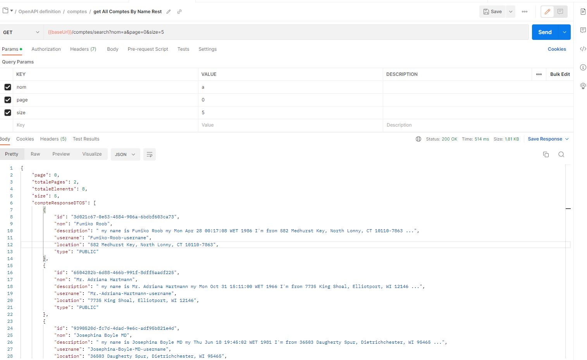

## Test REST API :

- CompteRestController : [:point_right:](./src/main/java/org/example/mscompte/web/CompteRestController.java)


<div  align="center">
            
</div>

```java
@GetMapping("/comptes")
public List<CompteResponseDTO> getAllComptesRest()
```


<div  align="center">
            
</div>


```java
@GetMapping("/comptes/search")
public ComptesResponseDTOPage getAllComptesByNameRest(@RequestParam(name = "nom",defaultValue = "") String name,
                                                          @RequestParam(name = "page",defaultValue = "0") int page,
                                                          @RequestParam(name = "size",defaultValue = "5") int size
                                                           )
```


<div  align="center">
            
 </div>


```java
@GetMapping("/comptes/{idCompte}")
public CompteDetailResponseDTO getCompteByIdRest(@PathVariable(name = "idCompte") String idCompte)
```


<div  align="center">
            
 </div>


```java
@PostMapping("/comptes")
public CompteDetailResponseDTO saveCompteRest(@RequestBody CompteRequestDTO compteRequestDTO)
```

<div  align="center">
            
 </div>


```java
@PutMapping("/comptes/{idCompte}")
public CompteDetailResponseDTO updateCompteRest(@RequestBody CompteRequestDTO compteRequestDTO,
                                                @PathVariable(name = "idCompte") String idCompte)
```

<div  align="center">
            
 </div>


```java
@DeleteMapping("/comptes/{idCompte}")
public String deleteCompteRest(@PathVariable(name = "idCompte") String idCompte)
```


<div  align="center">
            
 </div>

```java
@GetMapping("/comptes/{idCompte}/followers")
public ComptesResponseDTOPage getFollowersRest(@PathVariable(name = "idCompte") String idCompte,
                                                    @RequestParam(name = "page",defaultValue = "0") int page,
                                                    @RequestParam(name = "size",defaultValue = "5") int size)
```


<div  align="center">
            
 </div>

```java
@GetMapping("/comptes/{idCompte}/followings")
public ComptesResponseDTOPage getFollowingsRest(@PathVariable(name = "idCompte") String idCompte,
                                                     @RequestParam(name = "page",defaultValue = "0") int page,
                                                     @RequestParam(name = "size",defaultValue = "5") int size)
```


<div  align="center">
            
 </div>

```java
@PutMapping("/comptes/{idCompte}/followings")
public String followingRest(@PathVariable(name = "idCompte") String idCompte , @RequestBody FollowingRequest following)
```

<div  align="center">
            
 </div>

```java
@ExceptionHandler(Exception.class)
public ResponseEntity<String> exceptionsHandler(Exception e)
```


<div  align="center">
            
 </div>


<div  align="center">
            
 </div>


<div  align="center">
            
 </div>