## Test SOAP :

<div  align="center">
        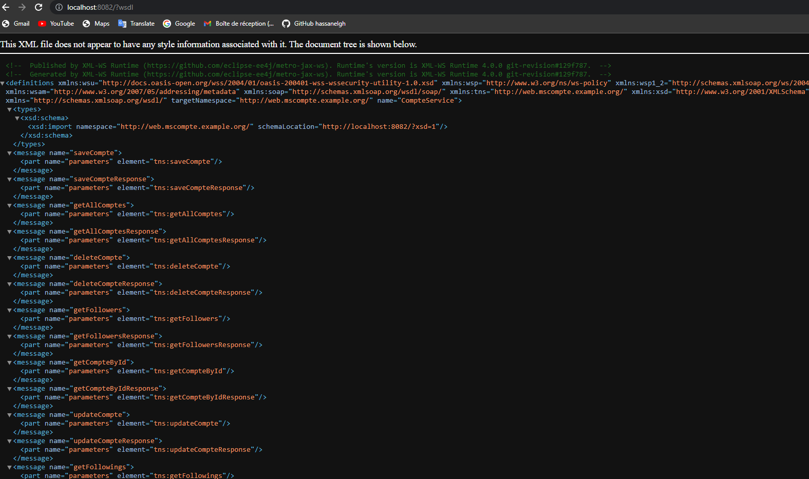    
</div>


```java
  @WebMethod()
  public List<CompteResponseDTO> getAllComptes()
```

<div  align="center">
        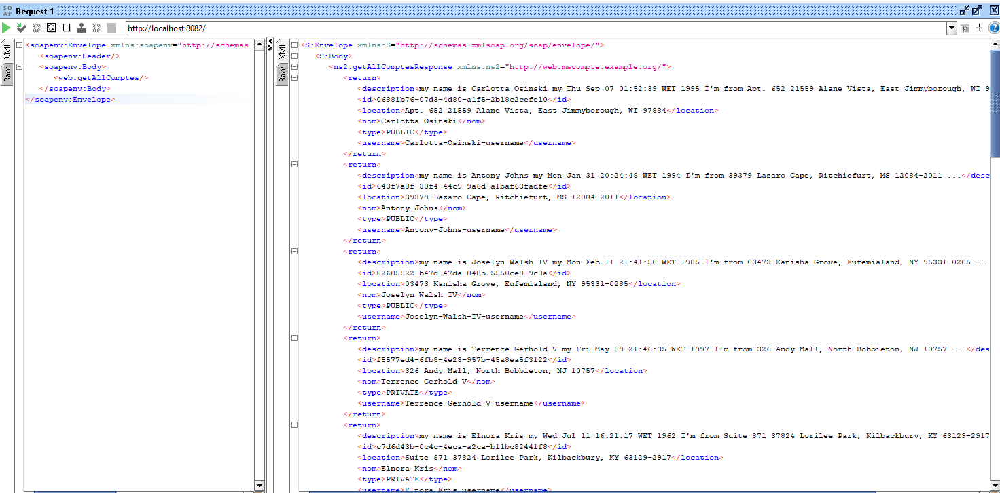
</div>


```java
  @WebMethod()
  public ComptesResponseDTOPage getAllComptesByName(@WebParam(name = "name") String name,
                                                      @WebParam(name = "page") int page,
                                                      @WebParam(name = "size") int size)
```

<div  align="center">
        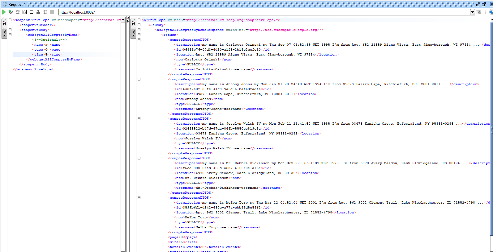
</div>


```java
  @WebMethod
  public CompteDetailResponseDTO getCompteById(@WebParam(name = "idCompte") String idCompte)
  }
```

<div  align="center">
        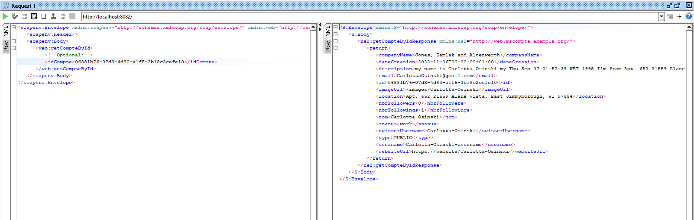
</div>


```java
  @WebMethod
  public CompteDetailResponseDTO updateCompte(@WebParam(name = "compteRequest") CompteRequestDTO compteRequestDTO, @WebParam(name = "idCompte") String idCompte)
```

<div  align="center">
        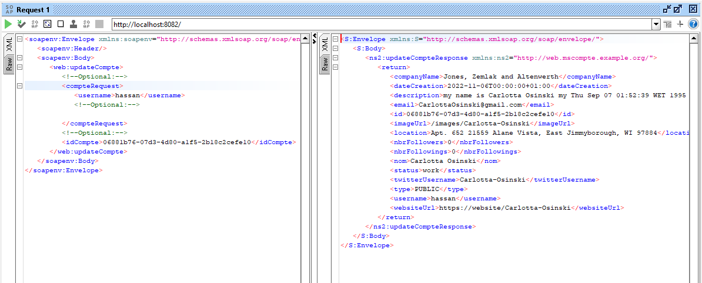
</div>


```java
  @WebMethod
  public CompteDetailResponseDTO saveCompte(@WebParam(name = "compteRequest") CompteRequestDTO compteRequestDTO)
```

<div  align="center">
        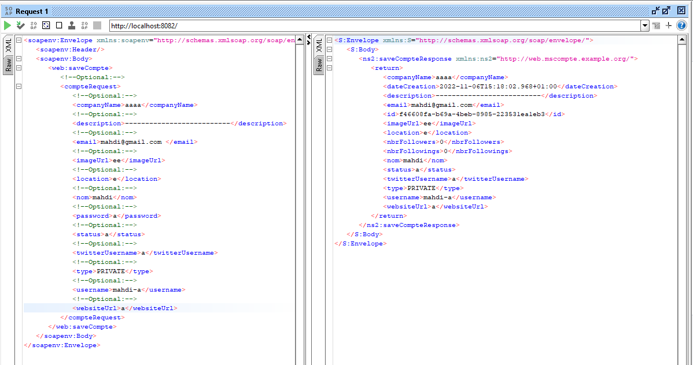
</div>

```java
  @WebMethod
  public String deleteCompte(@WebParam(name = "idCompte") String idCompte)
```

<div  align="center">
        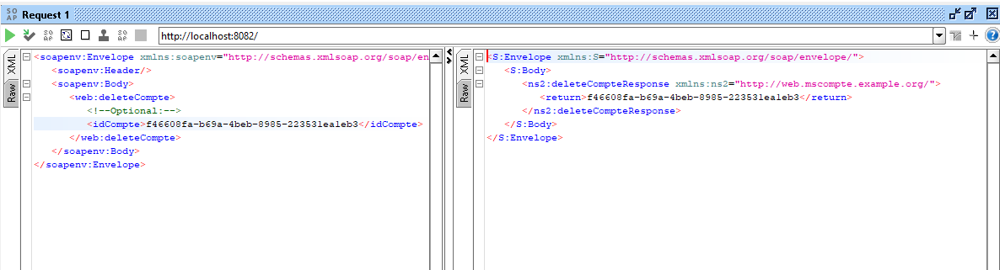
</div>


```java
  @WebMethod
  public ComptesResponseDTOPage getFollowers(@WebParam(name = "idCompte") String idCompte,
                                              @WebParam(name = "page") int page,
                                              @WebParam(name = "size") int size)
```
<div  align="center">
        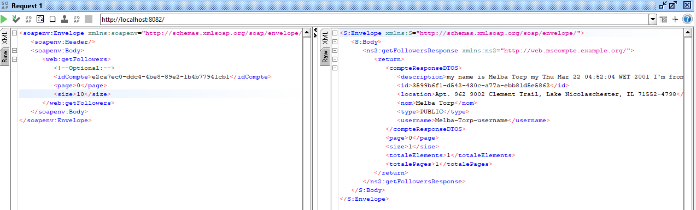
</div>


```java
  @WebMethod()
  public ComptesResponseDTOPage getFollowings(@WebParam(name = "idCompte") String idCompte,
                                              @WebParam(name = "page") int page,
                                              @WebParam(name = "size") int size)
```


<div  align="center">
        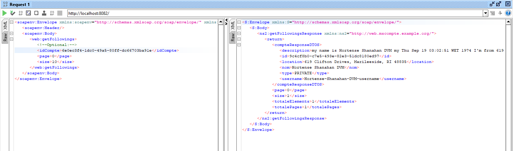
</div>


```java
  @WebMethod()
  public String following(@WebParam(name = "idCompte") String idCompte , @WebParam(name = "following") FollowingRequest following)
```


<div  align="center">
        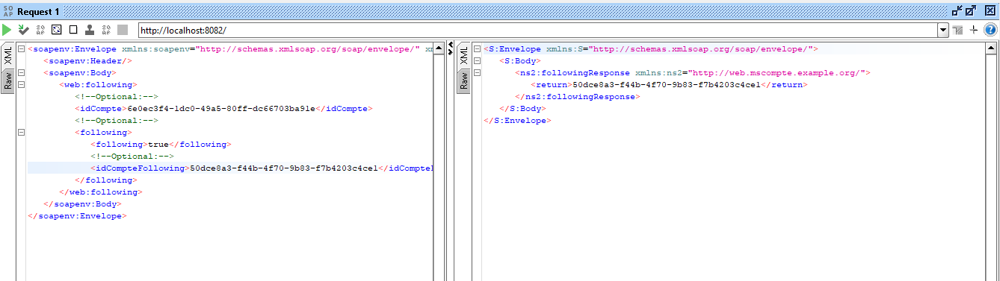
</div>

<div  align="center">
        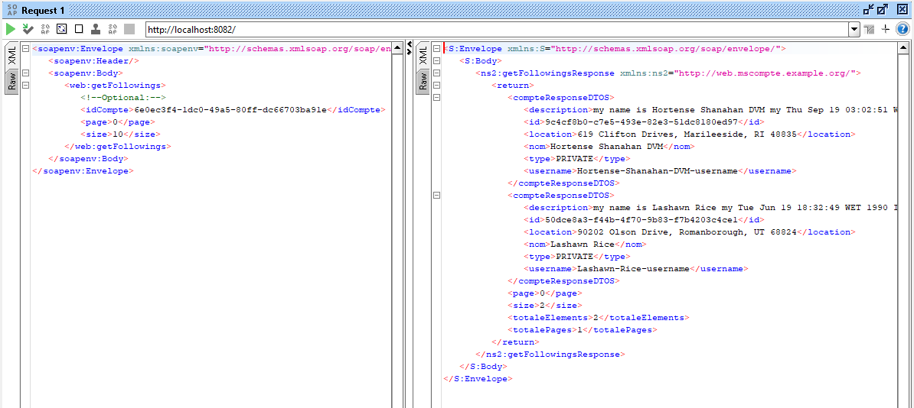
</div>

<div  align="center">
        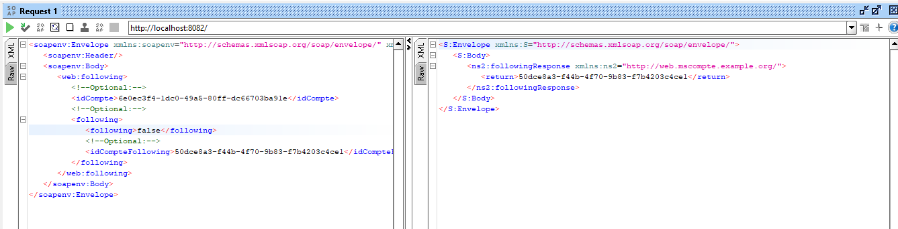
</div>

<div  align="center">
        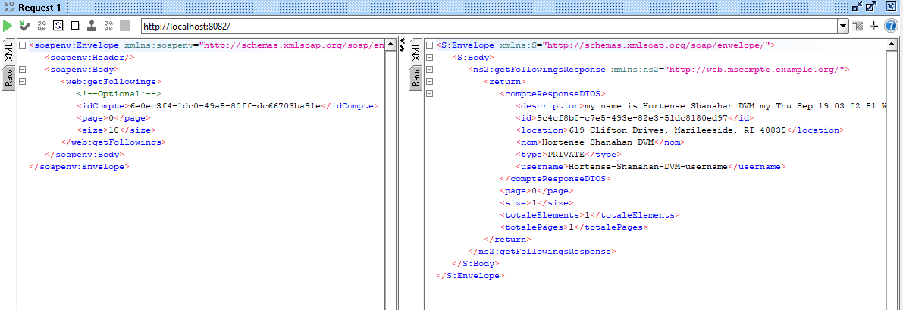
</div>
